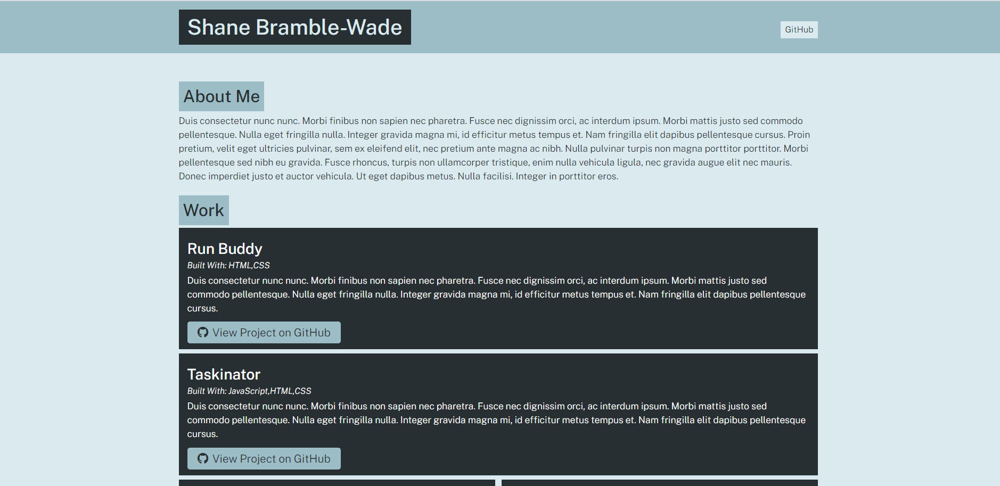

# Portfolio-Generator

# Description

In this module, I used node.js to build a program that creates a GitHub portfolio page using the command line to capture user input and place it in a JavaScript function that outputs a finished HTML page.



# Pre-requisites

- Install [Node.js](https://nodejs.org/en/) version 8.0.0

# Getting started

- Clone the repository

```
git clone  <git ssh url> 
```

- Install dependencies

```
cd <project_name>
npm install
```

- Build and run the project

```
npm start
```

### Built With

- HTML
- CSS
- JavaScipt
- Node.js

## Contribution

Made with ❤️ by Shane Bramble-Wade

### ©️2021 Portfolio Generator, Inc
